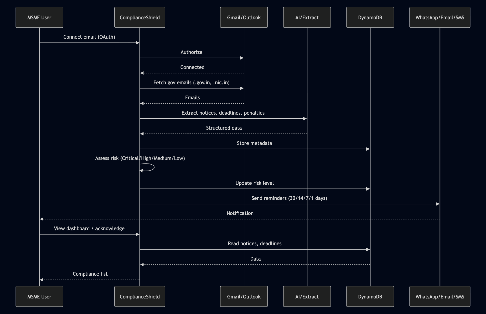

# 🛡️ ComplianceShield AI

**AI-powered compliance monitoring for Indian MSMEs**  
[AI for Bharat](https://vision.hack2skill.com/event/ai-for-bharat) · Vision | Hack2skill

---

## Problem

Indian MSMEs get compliance notices from GST, MCA, Labour, Environment via email. Many miss deadlines → penalties, legal risk, and no dedicated compliance team.

## Solution

- Connect email (Gmail/Outlook) via OAuth
- Filter `.gov.in` / `.nic.in` only → AI extracts notices, deadlines, penalties (Bedrock, Textract, Comprehend)
- Risk levels + reminders at 30/14/7/1 days
- Multi-channel notifications: WhatsApp, Email, SMS
- Metadata-only storage, India regions, DPDP-aligned

## Architecture

**High-level**

**Detailed AWS architecture**

More: [design.md](design.md#high-level-architecture)

## User journey

## Submission (AI for Bharat)

**Submit:** [AI for Bharat submission dashboard](https://vision.hack2skill.com/event/ai-for-bharat/dashboard/submissions)

| Field | Copy-paste |
|-------|------------|
| **Project** | ComplianceShield AI |
| **Tagline** | AI-powered compliance monitoring for Indian MSMEs — never miss a government deadline. |
| **Description** | Connects email via OAuth, filters gov domains, uses AWS AI to extract compliance notices and deadlines. Risk levels + reminders via WhatsApp, Email, SMS. Metadata-only, India regions, serverless. |
| **Repo** | `https://github.com/The-Semicolons-Team/ComplianceShieldAI` |

---

**Team:** The Semicolons Team  
Details: [requirements.md](requirements.md) · [design.md](design.md)
