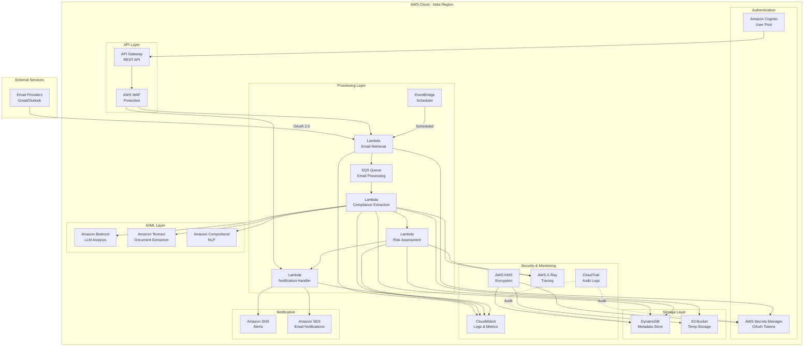

# Design Document: AI Compliance Monitoring System for Indian MSMEs

## Overview

This document describes the technical design for a secure, stateless, serverless AI compliance monitoring system built exclusively on AWS services. The system integrates with email providers via OAuth, extracts government compliance notices using AI/ML, identifies deadlines, assesses risk levels, and stores structured metadata in a cost-optimized manner.

The architecture follows AWS Well-Architected Framework principles with emphasis on security, scalability, cost optimization, and operational excellence. All data remains within AWS India regions to comply with Indian data regulations.

## Architecture

### High-Level Architecture



### Architecture Principles

1. **Serverless-First**: All compute uses AWS Lambda for automatic scaling and pay-per-use pricing
2. **Stateless Design**: No session state maintained; all context derived from DynamoDB metadata
3. **Event-Driven**: EventBridge and SQS orchestrate asynchronous processing workflows
4. **Security by Default**: Encryption at rest and in transit, least privilege IAM, VPC endpoints
5. **Cost-Optimized**: ARM-based Lambda, DynamoDB on-demand, intelligent filtering, lifecycle policies
6. **Regional Isolation**: All resources deployed in AWS India regions (ap-south-1 Mumbai, ap-south-2 Hyderabad)

## Components and Interfaces

### 1. API Gateway and Authentication

**Purpose**: Provides secure REST API endpoints for user interactions and integrations.

**Components**:
- **API Gateway**: REST API with request validation, throttling, and CORS support
- **AWS WAF**: Web application firewall with managed rule sets for OWASP Top 10 protection
- **Amazon Cognito**: User pool for authentication with MFA support

**Interfaces**:
```
POST /auth/oauth/initiate
  Request: { provider: "gmail" | "outlook" }
  Response: { authorizationUrl: string, state: string }

POST /auth/oauth/callback
  Request: { code: string, state: string }
  Response: { userId: string, status: "connected" }

GET /compliance/notices
  Query: { startDate?: ISO8601, endDate?: ISO8601, category?: string, riskLevel?: string }
  Response: { notices: ComplianceNotice[], nextToken?: string }

GET /compliance/notices/{noticeId}
  Response: ComplianceNotice

PUT /compliance/notices/{noticeId}/acknowledge
  Request: { acknowledgedBy: string, notes?: string }
  Response: { status: "acknowledged", timestamp: ISO8601 }

GET /compliance/deadlines
  Query: { daysAhead?: number, riskLevel?: string }
  Response: { deadlines: Deadline[] }

POST /notifications/preferences
  Request: { email: boolean, sms: boolean, quietHours: { start: string, end: string } }
  Response: { status: "updated" }

GET /health
  Response: { status: "healthy", timestamp: ISO8601 }
```

**Security**:
- API Gateway uses Cognito authorizer for JWT validation
- Rate limiting: 1000 requests/hour per user
- Request/response logging to CloudWatch
- API keys for programmatic access with rotation policy

### 2. Email Integration Service

**Purpose**: Authenticates with email providers and retrieves emails from government domains.

**Components**:
- **Lambda Function**: `email-retrieval-handler` (Node.js 20.x on ARM64)
- **AWS Secrets Manager**: Stores encrypted OAuth tokens with automatic rotation
- **EventBridge Rule**: Triggers email retrieval every 4 hours

**Processing Flow**:
1. EventBridge triggers Lambda on schedule
2. Lambda retrieves OAuth token from Secrets Manager
3. Lambda calls email provider API (Gmail API / Microsoft Graph API)
4. Filters emails from government domains (.gov.in, .nic.in)
5. Fetches only unprocessed emails since last run (tracked in DynamoDB)
6. Batches emails into groups of 100
7. Sends each batch to SQS queue for processing
8. Updates last processed timestamp in DynamoDB

**OAuth Implementation**:
```
OAuth Flow:
1. User initiates: GET /auth/oauth/initiate?provider=gmail
2. System generates state token, stores in DynamoDB with TTL
3. Returns authorization URL to user
4. User authorizes, provider redirects to callback
5. System validates state token
6. Exchanges authorization code for access/refresh tokens
7. Encrypts tokens with KMS
8. Stores in Secrets Manager with user association
9. Sets up automatic token rotation (45 days)
```

**Email Filtering Logic**:
```
Filter Criteria:
- Sender domain matches: *.gov.in, *.nic.in
- Not in processed_emails DynamoDB table
- Received date > last_processed_timestamp
- Subject or body contains compliance keywords (configurable)

Batch Processing:
- Max 100 emails per batch
- Each batch sent as single SQS message
- SQS message includes: emailIds[], userId, batchId
```

**Error Handling**:
- OAuth token refresh failure: Notify user, mark integration as disconnected
- API rate limiting: Exponential backoff with jitter
- Network errors: Retry 3 times, then send to DLQ
- Invalid email format: Log warning, skip email, continue processing

### 3. Compliance Extraction Engine

**Purpose**: Analyzes emails using AI/ML to extract structured compliance information.

**Components**:
- **Lambda Function**: `compliance-extraction-handler` (Python 3.12 on ARM64, 3GB memory, 5min timeout)
- **Amazon Bedrock**: Claude 3 Sonnet for compliance analysis
- **Amazon Textract**: PDF and image text extraction
- **Amazon Comprehend**: Entity recognition and key phrase extraction

**Processing Flow**:
1. Lambda triggered by SQS message (batch size: 10)
2. For each email in batch:
   - Extract email body and metadata
   - If attachments present, download to /tmp
   - Use Textract to extract text from PDFs/images
   - Combine email body + attachment text
3. Send combined text to Bedrock with structured prompt
4. Parse Bedrock response into structured format
5. Use Comprehend for additional entity extraction
6. Store structured metadata in DynamoDB
7. Delete temporary files from /tmp
8. Delete SQS message on success

**AI Prompt Structure**:
```
System Prompt:
You are an AI assistant specialized in analyzing Indian government compliance notices. 
Extract structured information from the provided text.

User Prompt:
Analyze the following email and extract compliance information:

Email Subject: {subject}
Email From: {sender}
Email Date: {date}
Email Body: {body}
Attachment Text: {attachment_text}

Extract and return JSON with the following structure:
{
  "isComplianceNotice": boolean,
  "complianceType": "Tax" | "Labor" | "Environmental" | "Corporate" | "Trade" | "Other",
  "issuingAuthority": string,
  "referenceNumber": string,
  "subject": string,
  "deadlines": [
    {
      "date": "YYYY-MM-DD",
      "type": "filing" | "payment" | "submission" | "response",
      "description": string
    }
  ],
  "requiredActions": string[],
  "penalties": {
    "amount": number,
    "currency": "INR",
    "description": string
  },
  "applicableRegulations": string[],
  "keywords": string[]
}

If this is not a compliance notice, set isComplianceNotice to false and return minimal data.
```

**Textract Integration**:
```
For PDF/Image Attachments:
1. Download attachment to /tmp/{filename}
2. Upload to S3 temp bucket with 24-hour lifecycle policy
3. Call Textract StartDocumentTextDetection (async)
4. Poll GetDocumentTextDetection until complete (max 60s)
5. Extract text blocks and concatenate
6. Delete from S3 after extraction
```

**Comprehend Enhancement**:
```
After Bedrock extraction:
1. Call DetectEntities on combined text
2. Extract: ORGANIZATION, DATE, LOCATION, QUANTITY
3. Call DetectKeyPhrases for additional context
4. Merge entities with Bedrock results
5. Improve deadline detection accuracy
```

**Error Handling**:
- Bedrock throttling: Exponential backoff, max 3 retries
- Textract timeout: Skip attachment, process email body only
- Invalid JSON from Bedrock: Log error, flag for manual review
- Comprehend errors: Continue without enhancement, log warning

### 4. Risk Assessment Service

**Purpose**: Calculates risk levels based on deadlines, penalties, and compliance history.

**Components**:
- **Lambda Function**: `risk-assessment-handler` (Python 3.12 on ARM64, 1GB memory, 1min timeout)
- **DynamoDB**: Reads compliance metadata and historical data

**Risk Calculation Algorithm**:
```python
def calculate_risk_level(notice: ComplianceNotice, history: ComplianceHistory) -> RiskLevel:
    score = 0
    
    # Deadline proximity scoring
    days_until_deadline = (notice.deadline - today).days
    if days_until_deadline <= 7:
        score += 40
    elif days_until_deadline <= 14:
        score += 30
    elif days_until_deadline <= 30:
        score += 20
    else:
        score += 10
    
    # Penalty severity scoring
    if notice.penalty_amount >= 100000:
        score += 30
    elif notice.penalty_amount >= 50000:
        score += 20
    elif notice.penalty_amount >= 10000:
        score += 10
    else:
        score += 5
    
    # Compliance category weighting
    category_weights = {
        "Tax": 1.2,
        "Labor": 1.1,
        "Corporate": 1.15,
        "Environmental": 1.0,
        "Trade": 1.0
    }
    score *= category_weights.get(notice.category, 1.0)
    
    # Historical compliance scoring
    if history.missed_deadlines_count > 0:
        score += 15
    if history.repeat_violation:
        score += 10
    
    # Determine risk level
    if score >= 70:
        return "Critical"
    elif score >= 50:
        return "High"
    elif score >= 30:
        return "Medium"
    else:
        return "Low"
```

**Processing Flow**:
1. Triggered after compliance extraction completes
2. Retrieve compliance notice from DynamoDB
3. Query historical compliance data for user
4. Calculate risk score using algorithm
5. Determine risk level
6. Update DynamoDB with risk level and score
7. If risk level is Critical, trigger immediate notification
8. Schedule reminder notifications based on risk level

**Reminder Schedule**:
```
Critical: Immediate + 1 day before deadline
High: 7 days + 1 day before deadline
Medium: 14 days + 3 days before deadline
Low: 30 days before deadline
```

### 5. Notification Service

**Purpose**: Sends timely notifications about compliance deadlines and new notices.

**Components**:
- **Lambda Function**: `notification-handler` (Node.js 20.x on ARM64, 512MB memory)
- **Amazon SNS**: Multi-channel notification delivery (email, SMS)
- **Amazon SES**: Transactional email delivery
- **EventBridge**: Scheduled reminder checks

**Notification Types**:
1. **New Compliance Notice**: Sent within 1 hour of extraction
2. **Deadline Reminder**: Sent at scheduled intervals
3. **Risk Level Change**: Sent when risk escalates
4. **Integration Status**: Sent when OAuth connection fails

**Processing Flow**:
1. Lambda triggered by:
   - Direct invocation from risk assessment (Critical notices)
   - EventBridge schedule (daily reminder check at 9 AM IST)
   - DynamoDB Stream (risk level changes)
2. Query DynamoDB for notices requiring notifications
3. Check user notification preferences
4. Respect quiet hours configuration
5. Batch non-critical notifications
6. Format notification content
7. Send via SNS (email) or SNS (SMS)
8. Update notification_sent timestamp in DynamoDB
9. Log delivery status

**Notification Content Template**:
```
Subject: [RISK_LEVEL] Compliance Deadline: {compliance_type}

Dear {user_name},

A compliance notice requires your attention:

Compliance Type: {compliance_type}
Issuing Authority: {issuing_authority}
Deadline: {deadline_date} ({days_remaining} days remaining)
Risk Level: {risk_level}

Required Actions:
{required_actions}

Penalties: {penalty_description}

Reference: {reference_number}

Please take necessary action before the deadline.

---
AI Compliance Monitoring System
```

**Batching Logic**:
```
Batching Rules:
- Critical: Send immediately, no batching
- High: Send immediately, no batching
- Medium: Batch up to 5 notices, send once per day
- Low: Batch up to 10 notices, send once per week

Quiet Hours:
- Check user preferences for quiet hours
- If current time in quiet hours, schedule for next available time
- Critical notices override quiet hours
```

**Error Handling**:
- SNS delivery failure: Retry 3 times with exponential backoff
- SES bounce/complaint: Mark email as invalid, notify admin
- SMS delivery failure: Fall back to email notification
- Rate limiting: Queue notifications, process in next batch

## Data Models

### DynamoDB Table: compliance_metadata

**Primary Key**:
- Partition Key: `user_id` (String)
- Sort Key: `notice_id` (String, UUID v4)

**Attributes**:
```json
{
  "user_id": "string (UUID)",
  "notice_id": "string (UUID)",
  "email_id": "string",
  "email_subject": "string",
  "email_sender": "string",
  "email_received_date": "string (ISO8601)",
  "processed_timestamp": "string (ISO8601)",
  
  "is_compliance_notice": "boolean",
  "compliance_type": "string (Tax|Labor|Environmental|Corporate|Trade|Other)",
  "compliance_category": "string",
  "issuing_authority": "string",
  "reference_number": "string",
  "subject": "string",
  
  "deadlines": [
    {
      "date": "string (ISO8601)",
      "type": "string (filing|payment|submission|response)",
      "description": "string",
      "days_remaining": "number"
    }
  ],
  
  "required_actions": ["string"],
  "penalties": {
    "amount": "number",
    "currency": "string",
    "description": "string"
  },
  "applicable_regulations": ["string"],
  "keywords": ["string"],
  
  "risk_level": "string (Critical|High|Medium|Low)",
  "risk_score": "number",
  "risk_factors": ["string"],
  
  "status": "string (pending|acknowledged|completed|expired)",
  "acknowledged_by": "string",
  "acknowledged_at": "string (ISO8601)",
  "notes": "string",
  
  "notification_sent": "boolean",
  "notification_timestamps": ["string (ISO8601)"],
  
  "ttl": "number (Unix timestamp)"
}
```

**Global Secondary Indexes**:

1. **DeadlineIndex**:
   - Partition Key: `user_id`
   - Sort Key: `deadlines[0].date`
   - Purpose: Query upcoming deadlines efficiently

2. **RiskLevelIndex**:
   - Partition Key: `user_id`
   - Sort Key: `risk_level#deadlines[0].date`
   - Purpose: Query by risk level and deadline

3. **CategoryIndex**:
   - Partition Key: `user_id`
   - Sort Key: `compliance_category#deadlines[0].date`
   - Purpose: Filter by compliance category

**Capacity Mode**: On-demand (auto-scaling based on traffic)

**Encryption**: AWS KMS customer-managed key

**Point-in-Time Recovery**: Enabled (35-day retention)

**TTL**: Enabled on `ttl` attribute (7 years = 220752000 seconds)

### DynamoDB Table: user_integrations

**Primary Key**:
- Partition Key: `user_id` (String)
- Sort Key: `provider` (String, "gmail" or "outlook")

**Attributes**:
```json
{
  "user_id": "string (UUID)",
  "provider": "string (gmail|outlook)",
  "email_address": "string",
  "connected_at": "string (ISO8601)",
  "last_sync_timestamp": "string (ISO8601)",
  "last_processed_email_id": "string",
  "oauth_secret_arn": "string (Secrets Manager ARN)",
  "status": "string (connected|disconnected|error)",
  "error_message": "string",
  "sync_frequency_hours": "number (default: 4)",
  "filter_domains": ["string (default: ['.gov.in', '.nic.in'])"]
}
```

**Encryption**: AWS KMS customer-managed key

### DynamoDB Table: processed_emails

**Primary Key**:
- Partition Key: `user_id` (String)
- Sort Key: `email_id` (String)

**Attributes**:
```json
{
  "user_id": "string (UUID)",
  "email_id": "string",
  "processed_at": "string (ISO8601)",
  "is_compliance_notice": "boolean",
  "notice_id": "string (UUID, if compliance notice)",
  "ttl": "number (Unix timestamp, 90 days)"
}
```

**Purpose**: Prevents duplicate processing of emails

**TTL**: 90 days (sufficient for deduplication)

### DynamoDB Table: notification_preferences

**Primary Key**:
- Partition Key: `user_id` (String)

**Attributes**:
```json
{
  "user_id": "string (UUID)",
  "email_enabled": "boolean (default: true)",
  "sms_enabled": "boolean (default: false)",
  "phone_number": "string (E.164 format)",
  "quiet_hours": {
    "enabled": "boolean",
    "start": "string (HH:MM)",
    "end": "string (HH:MM)",
    "timezone": "string (Asia/Kolkata)"
  },
  "batch_non_critical": "boolean (default: true)",
  "critical_override_quiet_hours": "boolean (default: true)",
  "reminder_schedule": {
    "critical": ["number (days before)"],
    "high": ["number (days before)"],
    "medium": ["number (days before)"],
    "low": ["number (days before)"]
  }
}
```

### AWS Secrets Manager: OAuth Tokens

**Secret Structure**:
```json
{
  "user_id": "string (UUID)",
  "provider": "string (gmail|outlook)",
  "access_token": "string (encrypted)",
  "refresh_token": "string (encrypted)",
  "token_type": "Bearer",
  "expires_at": "string (ISO8601)",
  "scope": "string"
}
```

**Rotation**: Automatic every 45 days using Lambda rotation function

**Encryption**: AWS KMS customer-managed key

**Access**: Only email-retrieval-handler Lambda has read permission

## Correctness Properties

*A property is a characteristic or behavior that should hold true across all valid executions of a system—essentially, a formal statement about what the system should do. Properties serve as the bridge between human-readable specifications and machine-verifiable correctness guarantees.*


### Property 1: OAuth Token Encryption

*For any* OAuth token received from email providers, the token must be encrypted using AWS KMS before storage in Secrets Manager, and the user-token association must use encrypted references.

**Validates: Requirements 1.3, 1.8**

### Property 2: OAuth Token Auto-Refresh

*For any* expired OAuth token, the system must automatically refresh it without user intervention, and only notify the user if refresh fails after all retry attempts.

**Validates: Requirements 1.5, 1.6**

### Property 3: Government Domain Email Filtering

*For any* batch of retrieved emails, only emails from verified government domains (.gov.in, .nic.in) should be processed, and all other emails must be filtered out before extraction.

**Validates: Requirements 2.1, 9.2**

### Property 4: Email Deduplication

*For any* email retrieval operation, the system must fetch only unprocessed messages since the last successful run, ensuring no email is processed more than once.

**Validates: Requirements 2.3, 2.5**

### Property 5: Email Batch Size Limit

*For any* email retrieval invocation, the system must process emails in batches not exceeding 100 messages per batch.

**Validates: Requirements 2.4**

### Property 6: Exponential Backoff Retry

*For any* failed operation (email retrieval, extraction, notification), the system must retry with exponential backoff up to 3 attempts before sending to dead letter queue.

**Validates: Requirements 2.6, 10.1, 10.2**

### Property 7: Email Field Extraction Completeness

*For any* email processed, the system must extract all required fields (subject, sender, body, attachments) before passing to the extraction engine.

**Validates: Requirements 2.8**

### Property 8: Compliance Notice Structured Extraction

*For any* identified compliance notice, the system must extract all required structured fields (issuing authority, subject matter, reference numbers, compliance type, applicable regulations, required actions) and store them in DynamoDB.

**Validates: Requirements 3.3, 3.4, 6.2**

### Property 9: Penalty Information Extraction

*For any* compliance notice mentioning monetary penalties, the system must extract the penalty amount, currency, and description as structured data.

**Validates: Requirements 3.5**

### Property 10: Compliance Category Classification

*For any* compliance notice, the system must assign exactly one category from the valid set (Tax, Labor, Environmental, Corporate, Trade, Other).

**Validates: Requirements 3.6**

### Property 11: Attachment Text Extraction

*For any* email containing PDF or image attachments, the system must use AWS Textract to extract text content and include it in the compliance analysis.

**Validates: Requirements 3.7**

### Property 12: Data Minimization

*For any* processed email, the system must store only structured metadata in DynamoDB and must not retain original email content, attachments, or unstructured text.

**Validates: Requirements 3.8, 6.3**

### Property 13: Date Extraction and Classification

*For any* compliance notice, the system must identify all mentioned dates using NLP and correctly classify them as issue dates, effective dates, or deadline dates.

**Validates: Requirements 4.1, 4.2**

### Property 14: Multiple Deadline Handling

*For any* compliance notice containing multiple deadlines, the system must extract and store each deadline separately with its type and description.

**Validates: Requirements 4.3**

### Property 15: Date Format Normalization

*For any* extracted deadline, the system must normalize the date to ISO 8601 format (YYYY-MM-DD) regardless of the original format in the notice.

**Validates: Requirements 4.4**

### Property 16: Days Remaining Calculation

*For any* deadline, the system must correctly calculate the number of days remaining from the current date to the deadline date.

**Validates: Requirements 4.5**

### Property 17: Reminder Notification Scheduling

*For any* deadline, the system must schedule reminder notifications at the configured intervals based on risk level (Critical: immediate + 1 day before; High: 7 days + 1 day before; Medium: 14 days + 3 days before; Low: 30 days before).

**Validates: Requirements 4.6**

### Property 18: Missing Deadline Flagging

*For any* compliance notice where no explicit deadline is found, the system must flag the notice for manual review.

**Validates: Requirements 4.7**

### Property 19: Deadline Expiration Marking

*For any* deadline that has passed, the system must mark it as expired while maintaining the historical record.

**Validates: Requirements 4.8**

### Property 20: Risk Level Calculation

*For any* compliance notice, the system must calculate a risk score based on deadline proximity, penalty severity, compliance category, and historical factors, then assign the appropriate risk level (Critical: score ≥70 or deadline ≤7 days or penalty ≥₹100,000; High: score ≥50 or deadline ≤14 days or penalty ≥₹50,000; Medium: score ≥30 or deadline ≤30 days or penalty ≥₹10,000; Low: score <30 and deadline >30 days and penalty <₹10,000).

**Validates: Requirements 5.1, 5.2, 5.3, 5.4, 5.5**

### Property 21: Risk Assessment Without Penalty

*For any* compliance notice without penalty information, the system must still calculate risk level based on deadline proximity, compliance category, and historical factors.

**Validates: Requirements 5.6**

### Property 22: Historical Risk Adjustment

*For any* user with previously missed deadlines or repeat violations, the system must increase the risk score for new compliance notices from the same category.

**Validates: Requirements 5.7**

### Property 23: Dynamic Risk Updates

*For any* compliance notice, as the deadline approaches and the risk level changes, the system must update the metadata in DynamoDB and trigger appropriate notifications.

**Validates: Requirements 5.8**

### Property 24: UUID Generation Uniqueness

*For any* compliance notice, the system must generate a unique identifier using UUID v4 format, ensuring no collisions across all notices.

**Validates: Requirements 6.4**

### Property 25: TTL Configuration

*For any* metadata record, the system must set the TTL attribute to 7 years (220,752,000 seconds) from the creation timestamp.

**Validates: Requirements 6.7**

### Property 26: Metadata Query Filtering

*For any* query request with filters (category, risk level, deadline range), the system must return only records matching all specified filter criteria.

**Validates: Requirements 6.8**

### Property 27: Log Sanitization

*For any* log entry, the system must redact sensitive information (email addresses, OAuth tokens, personal identifiers) before writing to CloudWatch.

**Validates: Requirements 7.5**

### Property 28: Extraction Performance

*For any* email, the compliance extraction process must complete within 30 seconds on average, measured from SQS message receipt to DynamoDB write completion.

**Validates: Requirements 8.3**

### Property 29: Temporary Attachment Storage Cleanup

*For any* attachment processed, the system must store it temporarily in S3 during extraction and automatically delete it within 24 hours using lifecycle policies.

**Validates: Requirements 8.8**

### Property 30: Data Export Completeness

*For any* user data export request, the system must return all compliance metadata associated with the user in machine-readable JSON format.

**Validates: Requirements 11.4**

### Property 31: Data Deletion Completeness

*For any* user data deletion request, the system must permanently delete all associated metadata (compliance notices, OAuth tokens, preferences, processed emails) within 30 days.

**Validates: Requirements 11.5**

### Property 32: Data Collection Minimization

*For any* data collection operation, the system must collect only the minimum necessary fields required for compliance monitoring functionality.

**Validates: Requirements 11.8**

### Property 33: New Notice Notification Timing

*For any* newly identified compliance notice, the system must send a notification to the user within 1 hour of extraction completion.

**Validates: Requirements 12.1**

### Property 34: Notification Content Completeness

*For any* notification sent, the message must include compliance type, deadline date, risk level, and required actions.

**Validates: Requirements 12.4**

### Property 35: Critical Notice Immediate Notification

*For any* compliance notice with Critical risk level, the system must send an immediate notification regardless of scheduled intervals or quiet hours configuration.

**Validates: Requirements 12.5**

### Property 36: Notification Preferences Respect

*For any* user with configured notification preferences (quiet hours, channel preferences), the system must respect these preferences for non-critical notifications.

**Validates: Requirements 12.6**

### Property 37: Non-Critical Notification Batching

*For any* non-critical notifications (Medium and Low risk), the system must batch them according to configured rules (Medium: up to 5 per day; Low: up to 10 per week) to avoid notification fatigue.

**Validates: Requirements 12.7**

### Property 38: Notification Delivery Retry

*For any* failed notification delivery, the system must retry up to 3 times with exponential backoff and log delivery failures to CloudWatch.

**Validates: Requirements 12.8**

### Property 39: API Authentication Enforcement

*For any* API request without valid authentication (API key or JWT token), the system must reject the request with HTTP 401 Unauthorized status.

**Validates: Requirements 13.2**

### Property 40: API Rate Limiting

*For any* user making API requests, the system must enforce a rate limit of 1000 requests per hour, rejecting excess requests with HTTP 429 Too Many Requests status.

**Validates: Requirements 13.3**

### Property 41: API Query Filtering

*For any* API query with filters (date range, category, risk level), the system must return only compliance notices matching all specified criteria in JSON format.

**Validates: Requirements 13.4**

### Property 42: API Response Format

*For any* API response, the system must return data in valid JSON format with appropriate HTTP status codes (200 for success, 400 for bad request, 401 for unauthorized, 404 for not found, 429 for rate limit, 500 for server error).

**Validates: Requirements 13.5**

### Property 43: Webhook Delivery

*For any* registered webhook, the system must deliver compliance notice notifications in real-time with retry logic for failed deliveries.

**Validates: Requirements 13.7**

### Property 44: API Error Messages

*For any* API error, the system must return a descriptive error message with a specific error code and HTTP status code.

**Validates: Requirements 13.8**

### Property 45: Structured Logging

*For any* operation, the system must log to CloudWatch using structured JSON format with required fields (timestamp, level, service, operation, user_id, trace_id, message).

**Validates: Requirements 14.1**

### Property 46: Anomaly Detection Alerting

*For any* detected anomaly (error rate spike, latency increase, processing failures), the system must trigger CloudWatch alarms and send notifications via SNS.

**Validates: Requirements 14.3**

### Property 47: Custom Metrics Tracking

*For any* operation, the system must track and publish custom metrics (emails_processed, compliance_notices_extracted, api_requests) to CloudWatch.

**Validates: Requirements 14.4**

### Property 48: Automated Health Degradation Alerts

*For any* system health degradation (Lambda errors >5%, DynamoDB throttling, API latency >2s), the system must automatically create alerts via SNS.

**Validates: Requirements 14.8**

### Property 49: Backup Data Integrity Validation

*For any* restore operation from backup, the system must validate data integrity (record counts, checksums, schema validation) before making the restored data available.

**Validates: Requirements 15.6**


## Error Handling

### Error Categories and Strategies

**1. Authentication Errors**
- **OAuth Token Expiration**: Automatic refresh using refresh token; notify user only if refresh fails
- **OAuth Token Revocation**: Mark integration as disconnected; send notification requesting re-authentication
- **Invalid Credentials**: Return 401 Unauthorized; log security event to CloudTrail
- **MFA Failure**: Reject authentication; enforce MFA retry with rate limiting

**2. Email Retrieval Errors**
- **API Rate Limiting**: Implement exponential backoff with jitter (1s, 2s, 4s); respect provider rate limits
- **Network Timeouts**: Retry up to 3 times; if all fail, send to DLQ for later processing
- **Invalid Email Format**: Log warning; skip email; continue processing batch
- **Provider API Changes**: Catch schema validation errors; alert administrators; flag for manual review

**3. Extraction Errors**
- **Bedrock Throttling**: Exponential backoff (2s, 4s, 8s); max 3 retries; if fails, send to DLQ
- **Textract Timeout**: Skip attachment processing; continue with email body only; log warning
- **Invalid JSON Response**: Log error with full context; flag email for manual review; continue processing
- **Comprehend Service Error**: Continue without NLP enhancement; log warning; extraction still succeeds

**4. Storage Errors**
- **DynamoDB Throttling**: Exponential backoff with jitter; implement request rate limiting
- **DynamoDB Capacity Exceeded**: Auto-scale using on-demand mode; alert if costs spike
- **S3 Upload Failure**: Retry 3 times; if fails, skip attachment; log error
- **KMS Key Unavailable**: Fail operation; alert administrators immediately; queue for retry

**5. Notification Errors**
- **SNS Delivery Failure**: Retry 3 times with exponential backoff; log failure; alert administrators
- **SES Bounce**: Mark email as invalid; disable email notifications; notify via SMS if available
- **SMS Delivery Failure**: Fall back to email notification; log delivery failure
- **Webhook Timeout**: Retry 3 times; if fails, log and continue; don't block processing

**6. API Errors**
- **Invalid Request**: Return 400 Bad Request with descriptive error message and field-level validation errors
- **Unauthorized Access**: Return 401 Unauthorized; log security event
- **Rate Limit Exceeded**: Return 429 Too Many Requests with Retry-After header
- **Resource Not Found**: Return 404 Not Found with error code
- **Internal Server Error**: Return 500 Internal Server Error; log full stack trace; alert administrators

### Error Logging Standards

All errors must be logged with the following structure:
```json
{
  "timestamp": "ISO8601",
  "level": "ERROR",
  "service": "service-name",
  "operation": "operation-name",
  "user_id": "uuid (redacted if sensitive)",
  "trace_id": "x-ray-trace-id",
  "error_code": "ERROR_CODE",
  "error_message": "Human-readable message",
  "error_details": {
    "exception_type": "ExceptionClass",
    "stack_trace": "Sanitized stack trace",
    "context": {}
  },
  "retry_count": 0,
  "sent_to_dlq": false
}
```

### Dead Letter Queue Processing

Messages in DLQ must be:
1. Retained for 14 days
2. Monitored with CloudWatch alarms (alert if >10 messages)
3. Reviewed daily by administrators
4. Manually reprocessed or marked as permanent failures
5. Analyzed for pattern detection (recurring errors indicate systemic issues)

### Circuit Breaker Pattern

For external service calls (email providers, Bedrock, Textract):
- **Closed State**: Normal operation
- **Open State**: After 5 consecutive failures, stop calling service for 60 seconds
- **Half-Open State**: After 60 seconds, allow 1 test request
- **Recovery**: If test succeeds, return to closed state; if fails, return to open state


## Testing Strategy

### Dual Testing Approach

This system requires both unit testing and property-based testing for comprehensive coverage:

- **Unit Tests**: Verify specific examples, edge cases, error conditions, and integration points
- **Property Tests**: Verify universal properties across all inputs through randomization
- Both approaches are complementary and necessary for high-confidence correctness

### Property-Based Testing

**Framework**: Use **fast-check** (for Node.js Lambda functions) and **Hypothesis** (for Python Lambda functions)

**Configuration**:
- Minimum 100 iterations per property test (due to randomization)
- Each property test must reference its design document property
- Tag format: `Feature: ai-compliance-monitoring-msme, Property {number}: {property_text}`

**Property Test Examples**:

```typescript
// Property 3: Government Domain Email Filtering
import fc from 'fast-check';

test('Feature: ai-compliance-monitoring-msme, Property 3: Government domain email filtering', () => {
  fc.assert(
    fc.property(
      fc.array(fc.record({
        from: fc.oneof(
          fc.constant('notice@gst.gov.in'),
          fc.constant('alert@mca.gov.in'),
          fc.constant('info@nic.in'),
          fc.constant('spam@example.com'),
          fc.constant('user@gmail.com')
        ),
        subject: fc.string(),
        body: fc.string()
      })),
      (emails) => {
        const filtered = filterGovernmentEmails(emails);
        // All filtered emails must be from government domains
        return filtered.every(email => 
          email.from.endsWith('.gov.in') || email.from.endsWith('.nic.in')
        );
      }
    ),
    { numRuns: 100 }
  );
});
```

```python
# Property 20: Risk Level Calculation
from hypothesis import given, strategies as st

@given(
    days_until_deadline=st.integers(min_value=1, max_value=365),
    penalty_amount=st.integers(min_value=0, max_value=10000000),
    category=st.sampled_from(['Tax', 'Labor', 'Environmental', 'Corporate', 'Trade']),
    missed_deadlines=st.integers(min_value=0, max_value=10)
)
def test_risk_level_calculation(days_until_deadline, penalty_amount, category, missed_deadlines):
    """
    Feature: ai-compliance-monitoring-msme
    Property 20: Risk level calculation
    """
    notice = ComplianceNotice(
        deadline=datetime.now() + timedelta(days=days_until_deadline),
        penalty_amount=penalty_amount,
        category=category
    )
    history = ComplianceHistory(missed_deadlines_count=missed_deadlines)
    
    risk_level = calculate_risk_level(notice, history)
    
    # Verify risk level is one of the valid values
    assert risk_level in ['Critical', 'High', 'Medium', 'Low']
    
    # Verify Critical classification rules
    if days_until_deadline <= 7 or penalty_amount >= 100000:
        assert risk_level in ['Critical', 'High']  # Should be high priority
    
    # Verify Low classification rules
    if days_until_deadline > 30 and penalty_amount < 10000 and missed_deadlines == 0:
        assert risk_level in ['Low', 'Medium']  # Should be low priority
```

**Property Test Coverage**:
- All 49 correctness properties must have corresponding property-based tests
- Focus on universal properties that hold for all inputs
- Use generators to create diverse test data (valid and invalid)
- Test boundary conditions through randomization

### Unit Testing

**Framework**: Use **Jest** (for Node.js) and **pytest** (for Python)

**Unit Test Focus**:
- Specific examples demonstrating correct behavior
- Edge cases (empty inputs, null values, boundary conditions)
- Error conditions and exception handling
- Integration points between components
- Mock external services (Bedrock, Textract, email providers)

**Unit Test Examples**:

```typescript
// Email Retrieval - Edge Cases
describe('Email Retrieval Handler', () => {
  test('handles empty email list gracefully', async () => {
    const result = await retrieveEmails(userId, lastSync);
    expect(result.emails).toEqual([]);
    expect(result.status).toBe('success');
  });

  test('handles OAuth token refresh failure', async () => {
    mockSecretsManager.getSecretValue.mockRejectedValue(new Error('Token expired'));
    
    await expect(retrieveEmails(userId, lastSync)).rejects.toThrow();
    expect(mockSNS.publish).toHaveBeenCalledWith(
      expect.objectContaining({
        Subject: expect.stringContaining('Re-authentication Required')
      })
    );
  });

  test('respects batch size limit of 100', async () => {
    const emails = generateMockEmails(250);
    const batches = createBatches(emails);
    
    expect(batches.length).toBe(3);
    expect(batches[0].length).toBe(100);
    expect(batches[1].length).toBe(100);
    expect(batches[2].length).toBe(50);
  });
});
```

```python
# Compliance Extraction - Specific Examples
def test_extract_gst_filing_notice():
    """Test extraction of a typical GST filing notice"""
    email_body = """
    Subject: GST Return Filing - GSTR-3B for March 2024
    From: gst@gov.in
    
    Dear Taxpayer,
    
    This is to remind you that GSTR-3B for the month of March 2024 is due on 20th April 2024.
    Late filing will attract a penalty of Rs. 50 per day (Rs. 20 per day for nil return).
    
    GSTIN: 29ABCDE1234F1Z5
    """
    
    result = extract_compliance_info(email_body)
    
    assert result['isComplianceNotice'] == True
    assert result['complianceType'] == 'Tax'
    assert result['issuingAuthority'] == 'GST Department'
    assert len(result['deadlines']) == 1
    assert result['deadlines'][0]['date'] == '2024-04-20'
    assert result['penalties']['amount'] == 50

def test_extract_notice_without_deadline():
    """Test handling of notice without explicit deadline"""
    email_body = "General information about labor law compliance."
    
    result = extract_compliance_info(email_body)
    
    assert result['isComplianceNotice'] == True
    assert result['flagForManualReview'] == True
    assert len(result['deadlines']) == 0
```

### Integration Testing

**Scope**: Test end-to-end workflows with mocked AWS services

**Key Integration Tests**:
1. **OAuth Flow**: User initiates → Authorization → Callback → Token storage
2. **Email to Notification**: Email retrieval → Extraction → Risk assessment → Notification
3. **API Query**: Request → Authentication → DynamoDB query → Response formatting
4. **Deadline Reminder**: EventBridge trigger → Query deadlines → Send notifications
5. **Error Recovery**: Failed extraction → DLQ → Manual reprocess → Success

**Tools**:
- **LocalStack**: Local AWS service emulation for integration tests
- **AWS SAM Local**: Test Lambda functions locally
- **Moto**: Mock AWS services in Python tests
- **AWS SDK Mock**: Mock AWS SDK calls in Node.js tests

### Load Testing

**Scenarios**:
1. **Peak Email Volume**: 10,000 emails/hour for 2 hours
2. **Concurrent API Requests**: 100 users making 10 requests/second
3. **Deadline Reminder Burst**: 1,000 notifications sent simultaneously
4. **Large Attachment Processing**: 100 emails with 5MB PDF attachments

**Tools**: Apache JMeter or Artillery for API load testing

**Success Criteria**:
- Email processing completes within 1 hour for 10,000 emails
- API response time remains under 2 seconds at 95th percentile
- No Lambda throttling or DynamoDB capacity errors
- All notifications delivered within SLA (1 hour for new notices)

### Security Testing

**Tests**:
1. **Authentication Bypass**: Attempt API access without valid tokens
2. **SQL Injection**: Test API inputs for injection vulnerabilities (though DynamoDB is NoSQL)
3. **XSS Prevention**: Test API responses for script injection
4. **Rate Limit Enforcement**: Exceed rate limits and verify 429 responses
5. **Data Encryption**: Verify all data at rest is encrypted with KMS
6. **Log Sanitization**: Verify no sensitive data in CloudWatch logs
7. **IAM Permissions**: Verify least privilege access for all roles

**Tools**:
- **OWASP ZAP**: Automated security scanning
- **AWS IAM Access Analyzer**: Identify overly permissive policies
- **AWS Config**: Verify security compliance rules

### Compliance Testing

**Tests**:
1. **Data Residency**: Verify all resources in ap-south-1 or ap-south-2
2. **Data Retention**: Verify TTL set to 7 years for compliance metadata
3. **Audit Logging**: Verify CloudTrail captures all data access
4. **Data Export**: Test user data export functionality
5. **Data Deletion**: Test user data deletion within 30 days
6. **Consent Management**: Verify consent collected before processing

### Monitoring and Observability Testing

**Tests**:
1. **CloudWatch Logs**: Verify structured logging for all operations
2. **Custom Metrics**: Verify metrics published correctly
3. **X-Ray Traces**: Verify end-to-end tracing works
4. **CloudWatch Alarms**: Trigger anomalies and verify alarms fire
5. **Dashboard Accuracy**: Verify dashboard metrics match actual operations

### Disaster Recovery Testing

**Tests**:
1. **Backup Restoration**: Restore DynamoDB from backup and verify data integrity
2. **Cross-Region Failover**: Simulate region failure and verify recovery
3. **RTO/RPO Validation**: Measure actual recovery time and data loss
4. **Runbook Execution**: Follow DR runbooks and verify completeness

**Frequency**: Quarterly DR drills with documented results

### Test Coverage Goals

- **Unit Test Coverage**: Minimum 80% code coverage
- **Property Test Coverage**: 100% of correctness properties tested
- **Integration Test Coverage**: All critical workflows tested
- **Security Test Coverage**: All OWASP Top 10 vulnerabilities tested
- **Performance Test Coverage**: All SLA-critical operations tested

### Continuous Testing

**CI/CD Pipeline**:
1. **Pre-commit**: Run unit tests and linting
2. **Pull Request**: Run unit tests, property tests, and security scans
3. **Staging Deployment**: Run integration tests and smoke tests
4. **Production Deployment**: Run smoke tests and monitor metrics
5. **Scheduled**: Run load tests weekly, security scans daily, DR tests quarterly

**Test Automation**:
- All tests automated in CI/CD pipeline
- No manual testing required for deployment
- Automated rollback on test failures
- Automated alerts for test failures

