# ComplianceShield AI — Diagrams

This document contains Mermaid diagrams for hackathon presentations and technical documentation. They render on GitHub and in any Mermaid-compatible viewer.

---

## 1. User Journey (End-to-End)


---

## 2. Data Flow (Email → Notification)

```mermaid
flowchart TB
    subgraph Input
        A[📧 Government Emails<br/>.gov.in / .nic.in]
    end

    subgraph Ingestion
        B[EventBridge Schedule]
        C[Lambda: Email Retrieval]
        D[OAuth Token from Secrets Manager]
        E[SQS: Email Batches]
    end

    subgraph Processing
        F[Lambda: Compliance Extraction]
        G[Bedrock + Textract + Comprehend]
        H[Structured JSON]
        I[Lambda: Risk Assessment]
        J[DynamoDB: Metadata]
    end

    subgraph Output
        K[Lambda: Notifications]
        L[SNS + SES]
        M[📱 User: Email / SMS]
    end

    A --> C
    B --> C
    D --> C
    C --> E
    E --> F
    F --> G
    G --> H
    H --> I
    I --> J
    I --> K
    J --> K
    K --> L
    L --> M
```



---

## 3. Sequence: From Email to Alert


---

## 4. Component Overview (Layers)


---

## 5. Risk Level Decision Flow

```mermaid
flowchart TD
    A[Compliance Notice Extracted] --> B{Deadline in ≤7 days?}
    B -->|Yes| C[+40 points]
    B -->|No| D{Deadline in ≤14 days?}
    D -->|Yes| E[+30 points]
    D -->|No| F{Deadline in ≤30 days?}
    F -->|Yes| G[+20 points]
    F -->|No| H[+10 points]

    C --> I{Penalty ≥ ₹1,00,000?}
    E --> I
    G --> I
    H --> I
    I -->|Yes| J[+30]
    I -->|No| K[+20 / +10 / +5]

    J --> L[× Category weight]
    K --> L
    L --> M{Missed deadlines /<br/>Repeat violation?}
    M -->|Yes| N[+15 / +10]
    M -->|No| O[Score as-is]
    N --> P{Score ≥ 70?}
    O --> P
    P -->|Yes| Q[🔴 Critical]
    P -->|No| R{Score ≥ 50?}
    R -->|Yes| S[🟠 High]
    R -->|No| T{Score ≥ 30?}
    T -->|Yes| U[🟡 Medium]
    T -->|No| V[🟢 Low]
```



---

## 6. Security & Data Residency


---

## 7. Notification Timeline (Reminders)

```mermaid
gantt
    title Deadline Reminder Schedule (example: deadline = Day 0)
    dateFormat  YYYY-MM-DD
    section Critical
    Immediate alert     :crit,  -30d, 1d
    1 day before       :crit,   -1d, 1d
    section High
    7 days before       :high,   -7d, 1d
    1 day before       :high,   -1d, 1d
    section Medium
    14 days before      :med,   -14d, 1d
    3 days before      :med,    -3d, 1d
    section Low
    30 days before      :low,   -30d, 1d
```

---

You can copy these diagrams into slides (e.g. Mermaid Live Editor, Notion, Confluence) or export as images for your hackathon deck.
